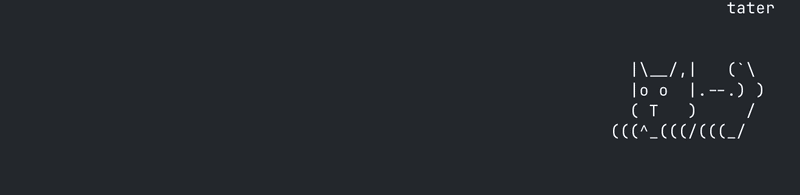

# mob

Tiny creatures who live at the bottom of your terminal.



## Install

```
curl -fsSL https://raw.githubusercontent.com/bboynton97/mob/main/scripts/install.sh | bash
```

## Use

```
mob frog    # or: dog, cat, turtle, slime
```

<!-- GIF: side-by-side of all 5 animals -->

## Keys

| key | does |
| --- | --- |
| `f` | feed (chew chew ♥) |
| `p` | pet (♥) |
| `t` | toss a toy |
| `s` | sleep / wake |
| `/` | command menu (name your pet, etc.) |
| `q` | quit |

<!-- GIF: feeding the cat, hearts drifting up -->

## Summon the whole zoo

```
./scripts/mob-all.sh
```

Opens one Terminal tab per critter.
