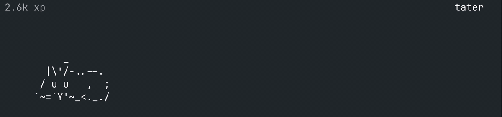
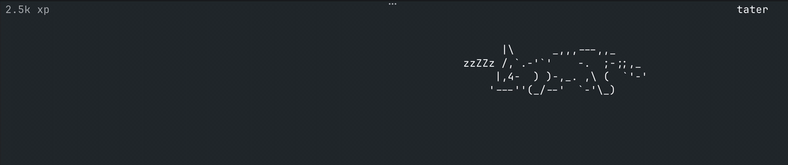

# ✦ mob ✦

˚ ｡ ⋆ ･ tiny creatures who live at the bottom of your terminal ･ ⋆ ｡ ˚



Only the animal shows up by default. Naming, xp, and the leaderboard are opt-in via the `/` menu ✧

＊ ･ ｡ﾟ ✦ ｡ﾟ ･ ＊

## ✦ install

```
curl -fsSL https://raw.githubusercontent.com/bboynton97/mob/main/scripts/install.sh | bash
```

## ✦ use

```
mob frog    # or: cat
```

＊ ･ ｡ﾟ ✦ ｡ﾟ ･ ＊

## ✦ xp ⋆｡˚

Your pet earns 2 xp for every successful shell command ⋆ total xp lives top-left, and each command floats a `+2 xp` toast above your pet.

### setup

xp tracking reads your shell history via [atuin](https://atuin.sh) ✧

1. In mob, open `/` and pick **Enable xp tracking**.
2. If atuin isn't installed, mob asks to install it. Hit **y** and mob exits, runs the official atuin installer, then relaunches itself with tracking on.
3. **Finish atuin's own setup** in your shell:
   ```
   atuin import auto                  # backfill your existing history
   eval "$(atuin init zsh)"           # or: bash, fish, nu (see atuin docs)
   ```
   The `init` line goes in your shell rc (`~/.zshrc`, `~/.bashrc`, etc.) so atuin captures every new command.
4. Open a fresh shell, run a few commands, and watch the toasts ✨

Already have atuin set up? Skip step 2. Toggling on is all you need.


＊ ･ ｡ﾟ ✦ ｡ﾟ ･ ＊

## ✦ name your pet ♡

Open `/` and pick "Give pet a name" ⋆ the name persists across sessions.

## ✦ leaderboard ⋆

Opt in and your pet's xp lands on a global leaderboard, ranked per animal ✧ open `/` and pick **Join leaderboard**.


＊ ･ ｡ﾟ ✦ ｡ﾟ ･ ＊

## ✦ contribute a critter ✿

Got an idea for a new animal? Open a PR ♡

Critters live in [`client/mob/art.py`](client/mob/art.py) as ASCII poses (idle, happy, eating, sleeping, blink, plus movement frames). Keep the width consistent across poses, pick `hop` or `crawl` for movement, and that's basically it. Bonus points for something weird (axolotl? tardigrade? roomba?).

```
    ∧,,,∧
   (  ̳• · • ̳)
   /    づ♡   thank u for contributing
```



˚ ｡ ⋆ ･ ✦ ･ ⋆ ｡ ˚
